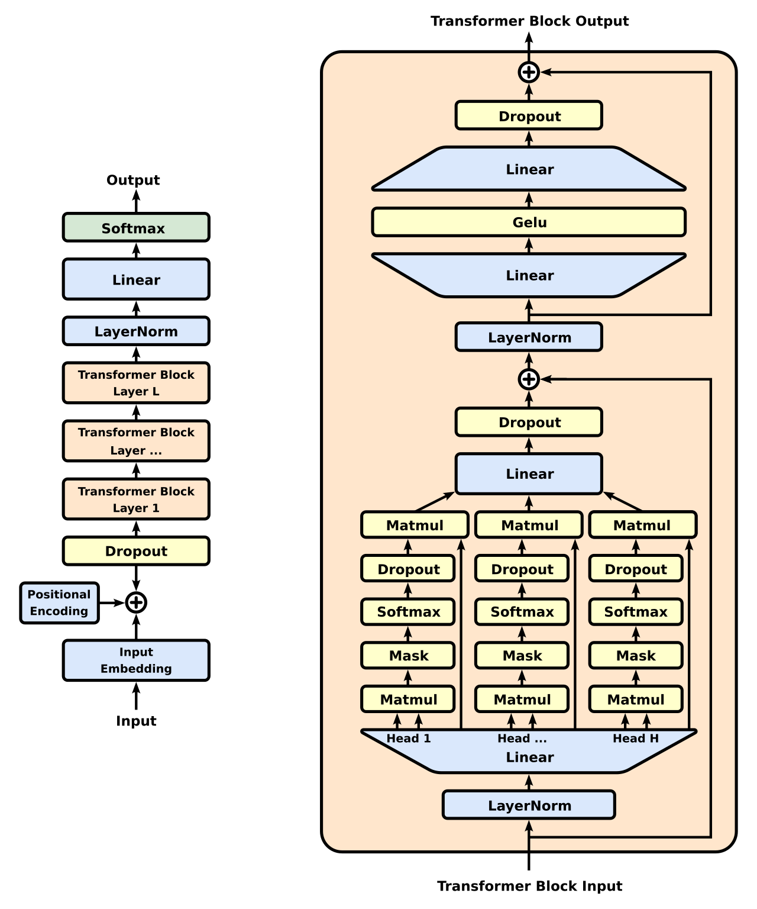
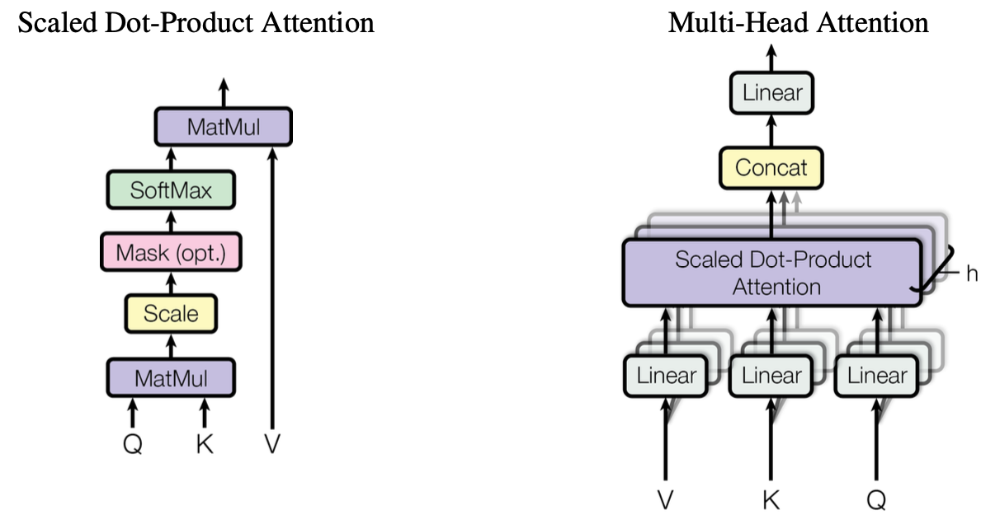

# Transformer Math

Consider a GPT like model as below:

We can list all the modules from bottom up:

- The word token embedding (WTE), word positioning embedding (WPE) and Dropout
- Transformer Blocks
  - Input LayerNorm
  - Attention block
    - Q, K, and V projection
    - Scaled Dot-Product Attention (SDPA)
    - Out projection and Dropout
  - Post-Attention LayerNorm
  - FFN block
    - Up projection
    - Activation (GeLU)
    - Down projection and Dropout
- The final LayerNorm
- Output layer and Cross-Entropy loss

Note:

## Params and FLOPs

Notations (same as ones in Megatron-LM paper):

- transformer layers $L$
- hidden size $h$
- number of attention head $a$
- per head hidden size $h_a$
- sequence length $𝑠$
- vocabulary size $v$
- training batch size $b$

The params and forward FLOPs in a transformer block:

| Item                | Formula                                       | Shape                                                        | Params        | Fwd FLOPs          | Comments                                                     |
| ------------------- |-----------------------------------------------| ------------------------------------------------------------ | ------------- | ------------------ |--------------------------------------------------------------|
| Q,K,V projection    | $Q=xW_Q \newline K=xW_K \newline V=xW_V$      | $[b, s, h] \times [h, h] = [b, s, h]$                        | $3h^2 + 3h$   | $3 * 2bsh^2$       | w/ bias                                                      |
| SDPA                | $z=\text {Softmax} (\frac{QK^T}{\sqrt{h}}) V$ | $QK^T: [b, a, s, h_a] \times [b, a, h_a, s] = [b, a, s, s] \newline \text{AttenScore} V: [b, a, s, s] \times [b, a, s, h_a] = [b, a, s, h_a]$ | 0             | $2 * 2bs^2h$       | $\text{AttenScore} = \text {Softmax}(\frac{QK^T}{\sqrt{h}})$ |
| Out projection      | $x_{o}=z W_O$                                 | $[b, s, h] \times [h, h] = [b, s, h]$                        | $h^2 + h$     | $2bsh^2$           | w/ bias                                                      |
| FFN up projection   | $y_1 = x_{o}W_1 + b_1$                        | $[b, s, h] \times [h, 4h] = [b, s, 4h]$                      | $4h^2 + 4h$   | $8bsh^2$           | $h \to 4h$, w/ bias                                          |
| FFN down projection | $y_2 = y_1 W_2 + b_2$                         | $[b, s, 4h] \times [4h, h] = [b, s, h]$                      | $4h^2 + h$    | $8bsh^2$           | $4h \to h$, w/ bias                                          |
| two LayerNorm       | \                                             | \                                                            | $4h$          | 0                  |                                                              |
| Total               |                                               |                                                              | $12h^2 + 13h$ | $24bsh^2 + 4bs^2h$ |                                                              |

And non-transformer block:

- the params of embedding layer: $(v + s)h$
- assume the weights of word token embedding and output layer are shared.
- the FLOPs of logits layer in the head (transforms features of dimension $h$ to the vocabulary dimension $v$): $2bshv$

The backward pass requires double the number of FLOPs since we need to calculate the gradients with respect to both input and weight tensors.

Then, the number of model FLOPs required to do one forward and one backward pass is:
$$
\begin{align}
F = 72bLsh^2( 1 + \frac{s}{6h} + \frac{v}{12hL})
\end{align}
$$
And we can get `FLOPs_per_token` (does not depend on batch_size):
$$
\begin{align}
\frac{\text{FLOPs per iter}}{\text{tokens per iter}} = \frac{F}{bs} = 72Lh^2 + 12Lsh + 6vh
\end{align}
$$

Note:

- Floating point operations (FLOPs), Floating point operations per second (FLOPS)
- Only consider the matrix multiplications (GEMMs) which are the main contributors to the number of floating-point operations. A $𝐴_{𝑚 \times 𝑘} \times 𝑋_{𝑘 \times 𝑛}$ matrix multiplication requires $2𝑚 \times 𝑘 \times 𝑛$ FLOPs (factor of 2 needed to account for multiplies and adds).
- For the FLOPs for SDPA with causal mask, we only need (a bit more than) half FLOPs of the full matrix multiplication with flash-attention. See the [discussion](https://github.com/pytorch/torchtitan/pull/280).

## MFU

Model FLOPs utilization (MFU) is the ratio of the observed throughput (tokens-per-second) relative to the theoretical maximum throughput of a system operating at peak FLOPs.
$$
\begin{align}
\text{MFU} = \frac{\text{(FLOPs/token) * (tokens/s)}}{\text{HW\_FLOPS}}
\end{align}
$$

General steps:

1. Get the forward FLOPs and the total (forward + backward) FLOPs of the model per iteration, only GEMM is counted.
2. Get the `FLOPs_per_token` of the model.
3. Get MFU based on `FLOPs_per_token`, training throughput and hardware FLOPS.

We can follow the same way to calculate the MFU of non-GPT models like Llama and MoE.

## Activation

Assume we use BF16 data type:

- Attention block: $11sbh + 5as^2b$ bytes
  - $Q$, $K$ and $V$ matrix multiplies: only need to store their **shared input** with size $2sbh$
  - Self-Attention (SDPA) block
    - $QK^T$: requires storage of both $Q$ and $K$ with total size $4sbh$
    - Softmax: Softmax output with size $2as^2b$ is required for back-propagation
    - Dropout: a mask with size $as^2b$
    - Attention over $V$: need to store the dropout output ($2as^2b$) and the Values ($2sbh$)
  - the linear projection stores its input activations with size $2sbh$
  - the attention dropout requires a mask with size $sbh$
- FFN block: $19sbh$ bytes
  - two linear layers: store their inputs with size $2sbh$ and $8sbh$
  - GeLU non-linearity also needs its input with size $8sbh$ for back-propagation
  - dropout stores its mask with size $sbh$
- LayerNorm: Each layer norm stores its input with size $2sbh$ and therefore in total, we will need $4sbh$ of storage.

The memory required to store the activations for a single layer of a transformer network is: $sbh(34 + 5 \frac{as}{h})$.

Note:

- When flash-attention is used, the activation for softmax output, Dropout (in SDPA) output and mask is not needed anymore.

## Model state

The model states include the optimizer states (such as momentum and variances in Adam), gradients, and parameters. Assume we train a model with $N$ parameters with BF16 data type, the memory footprint of model states is $18N$:

- parameters: $2N$ for BF16 weight
- gradients: $4N$ for FP32 gradients
- optimizer states (Adam)
  - $4N$ for FP32 master weight
  - $8N$ for FP32 momentum and variances

Note:

- For FP32 gradients, we follow the same way as [Distributed Optimizer in Megatron-LM](https://github.com/NVIDIA/Megatron-LM?#distributed-optimizer).

## Ref

- [Generative pre-trained transformer](https://en.wikipedia.org/wiki/Generative_pre-trained_transformer)
- [Attention Is All You Need](https://arxiv.org/abs/1706.03762)
- [Efficient Large-Scale Language Model Training on GPU Clusters Using Megatron-LM](https://arxiv.org/abs/2104.04473)
- [Reducing Activation Recomputation in Large Transformer Models](https://arxiv.org/abs/2205.05198)
- [FlashAttention-2: Faster Attention with Better Parallelism and Work Partitioning](https://arxiv.org/abs/2307.08691)
- [PaLM: Scaling Language Modeling with Pathways](https://arxiv.org/abs/2204.02311)

